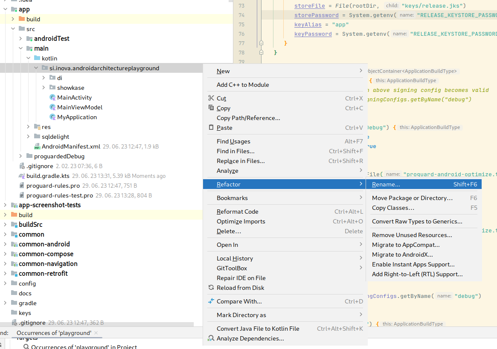

# Template project for Kotlinova-architecture-based projects

Empty template Android project with basic Kotlinova architecture set up.

To create a new Android project from that:

1. Clone this repo (`empty_kotlinova_project` branch)
2. Copy all files (except for the .git folder) into your new project's folder
3. Rename si.inova.androidarchitectureplayground folder (package)    
       
   When asked, select "All Directories". This should rename all of those packages in the project
4. Rename default no resources namespace in `buildSrc/src/main/kotlin/android-module-commons.gradle.kts`
5. Rename theme in `app/res/values/themes.xml`
6. Rename `namespace`, `applicatonId` and `testInstrumentationRunner` in `app/build.gradle.kts`
7. Rename `namespace` in `app-screenshot-tests/build.gradle.kts`
8. Rename `namespace` in `common-compose/build.gradle.kts`
9. Rename `rootProject.name` in `settings.gradle.kts`
10. Rename `app_name` in `app/res/values/strings.xml`
11. Rename theme in `common-compose/src/.../ui/theme/Theme.kt`
12. Rename `My` prefix of `MyApplication` to the name of your application
13. Generate debug and release keystore (see below)
14. Go through all TODOs inside the project
12. Remove everything until `Readme for the application` from this README

## Keystore

To generate keys, you can execute these command inside `keys` folder:

```bash
KEYSTORE_PASSWORD=$(dd if=/dev/random bs=3 count=12 2>/dev/null | base64 | sed 's/ .*$//')
echo y | keytool -genkey -keystore ./release.jks -dname "ou=Inova IT" -alias app -storepass $KEYSTORE_PASSWORD -keyalg RSA -keysize 2048 -validity 9125
echo y | keytool -genkey -keystore ./debug.jks -dname "ou=Inova IT" -alias androiddebugkey -storepass android -keyalg RSA -keysize 2048 -validity 9125
echo "RELEASE_KEYSTORE_PASSWORD = '$KEYSTORE_PASSWORD'"

echo

echo "DEBUG CERTIFICATE FINGERPRINTS:"
keytool -list -v -keystore "debug.jks" -alias androiddebugkey -storepass android -keypass android

echo "RELEASE CERTIFICATE FINGERPRINTS:"
keytool -list -v -keystore "release.jks" -alias app -storepass $KEYSTORE_PASSWORD -keypass $KEYSTORE_PASSWORD
```

Afterwards:

1. Enter generated keystore password into Github project's secrets (and ideally also store it somewhere else as a backup).
2. Enter generated SHA1 and SHA256 fingerprints into `app/build.gradle.kts`, so they can be used later.

# Readme for the application

## Updating versions

Process for updating all library versions::

1. ~~Run `./gradlew dependencyUpdates :buildSrc:dependencyUpdates --no-configuration-cache > /dev/null
   && ./gradlew :app:updateLibsToml`.
   This will check for new versions of all libraries and automatically bump versions inside `libs.toml`.~~
   Until [AGP issue](https://issuetracker.google.com/issues/315689874) is resolved, auto update
   is broken. You must open libs.toml, and manually update all versions
   that are marked in yellow (Lint warning)
2. Check the output of the above task and manually update any libraries that task said it couldn't update automatically.
2. Sync the project, build the app and run all tests to make sure everything still works.
3. Run `detektDebug` gradle task to find any new deprecated code
4. For any new deprecated code found by the search:
    * If the fix is trivial, fix it immediately as part of the update commit
    * Otherwise, make a tech debt ticket and add a @Suppress with the ticket number
      (and/or discuss with the team how to address it)

## Creating a new module

1. Copy module template from `config/templates` folder to root of the project and rename it to your module
2. If new module is an android library and if it needs android resources, add `buildFeatures { androidResources = true }`
   and namespace declaration to module's `build.gradle.kts`
3. Add module to `settings.gradle.kts`
4. Add module to app's `build.gradle.kts` as `implementation(projects.newModule)`)

## Hierarchy of the feature modules

Every feature should contain following modules:

* `feature-name`
    * `data` - data module with all non-UI logic (such as repositories).
      No other module (except for top level `app`) should depend on this.
    * `api` - interfaces and data models exposed to other modules.
      This module should generally contain no logic to speed up builds.
    * `ui` - Module containing feature's ui (Screens / Fragments / ViewModels)
    * `test` (optional) - Module containing test helpers for all other modules in this group

## Running integration tests

`./gradlew :app:connectedAndroidTest -PtestAppWithProguard`

# Creating screenshot tests

To create screenshot tests for your compose screen:

1. Make preview functions public
2. Add `showkase` plugin to the module of the screen you want to test
2. Add `@ShowkaseComposable(group = "Test")` annotation to the preview of the screen you want to test
3. run `recordPaparazziDebug` gradle task to record golden screenshot
   (double check that only previews for your screen were generated)
